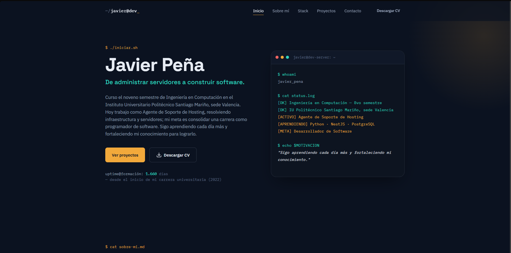
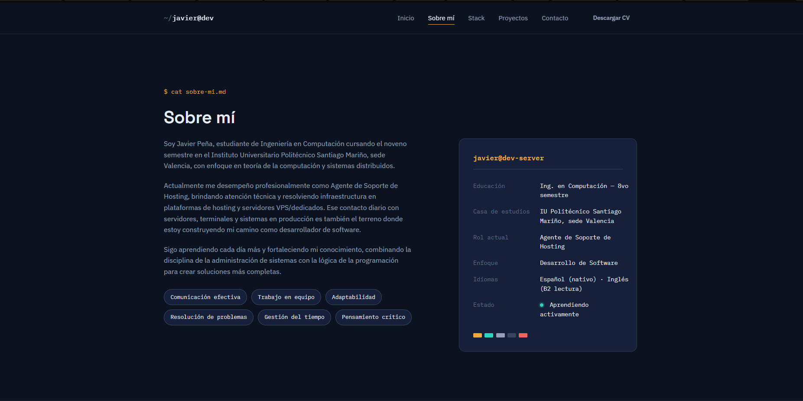
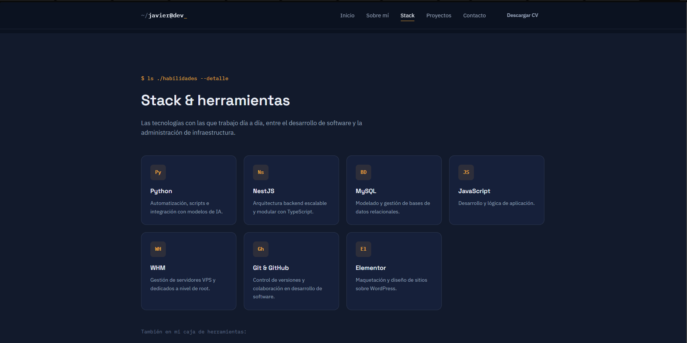
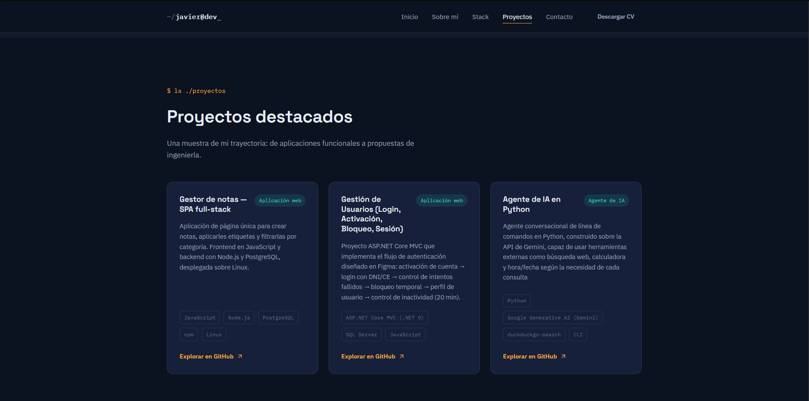
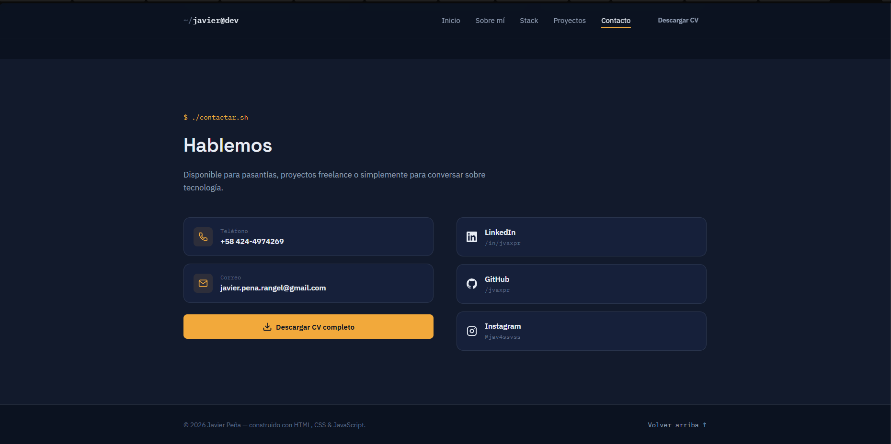

# Portafolio — Javier Peña

> De administrar servidores a construir software.




Sitio de portafolio de **Javier Peña**, estudiante de noveno semestre de
Ingeniería en Computación en el Instituto Universitario Politécnico Santiago
Mariño (sede Valencia) y Agente de Soporte de Hosting en camino a convertirse
en desarrollador de software.

🔗 **Demo en vivo:** [portfolio-javier-pena.vercel.app](https://portfolio-javier-pena.vercel.app)

## Vista previa

<table>
  <tr>
    <td width="50%">
      <strong>Sobre mí</strong><br>
      
    </td>
    <td width="50%">
      <strong>Stack & herramientas</strong><br>
      
    </td>
  </tr>
  <tr>
    <td width="50%">
      <strong>Proyectos destacados</strong><br>
      
    </td>
    <td width="50%">
      <strong>Contacto</strong><br>
      
    </td>
  </tr>
</table>

## Sobre el sitio

Un portafolio de una sola página con identidad visual inspirada en terminales
y paneles de administración de servidores — el entorno de trabajo diario de
un agente de soporte de hosting — combinada con una estética de software
moderna:

- Hero con un efecto de "escritura" tipo terminal que resume el perfil como
  un `status.log`.
- Tarjeta de presentación estilo `neofetch` en la sección "Sobre mí".
- Stack técnico organizado por tarjetas: **Python, NestJS, MySQL,
  JavaScript, WHM, Git & GitHub y Elementor**.
- Tres proyectos destacados: una aplicación de notas full-stack, un flujo de
  autenticación de usuarios en ASP.NET Core MVC, y un agente conversacional
  en Python sobre la API de Gemini.
- Sección de contacto con enlaces directos a teléfono, correo, LinkedIn,
  GitHub e Instagram, y descarga directa del CV.
- Diseño 100% responsivo, con menú móvil, resaltado de sección activa y
  animaciones de aparición al hacer scroll.
- Accesible: respeta `prefers-reduced-motion`, usa atributos `aria-*` en los
  elementos interactivos y cuenta con un skip-link al contenido principal.

## Construido con

- **HTML5** semántico
- **CSS3** — variables (custom properties), Grid y Flexbox, sin preprocesadores
- **JavaScript** vanilla — sin librerías ni frameworks (`IntersectionObserver`,
  Clipboard API)

## Despliegue

El sitio está alojado en **[Vercel](https://vercel.com)**, conectado
directamente a este repositorio. Cada `push` a la rama `main` dispara un
despliegue automático, así que la versión en línea siempre refleja el
último commit.

## Ejecutarlo localmente

No requiere Node, npm ni ningún paso de compilación:

```bash
git clone <URL-del-repositorio>
cd portfolio-javier-pena
python3 -m http.server 8000
```

Luego abrir `http://localhost:8000` en el navegador.

## Contacto

**Javier Peña**
📧 [javier.pena.rangel@gmail.com](mailto:javier.pena.rangel@gmail.com) · 📱 +58 424-4974269
🔗 [LinkedIn](https://www.linkedin.com/in/jvaxpr) · [GitHub](https://github.com/jvaxpr) · [Instagram](https://www.instagram.com/jav4ssvss)
